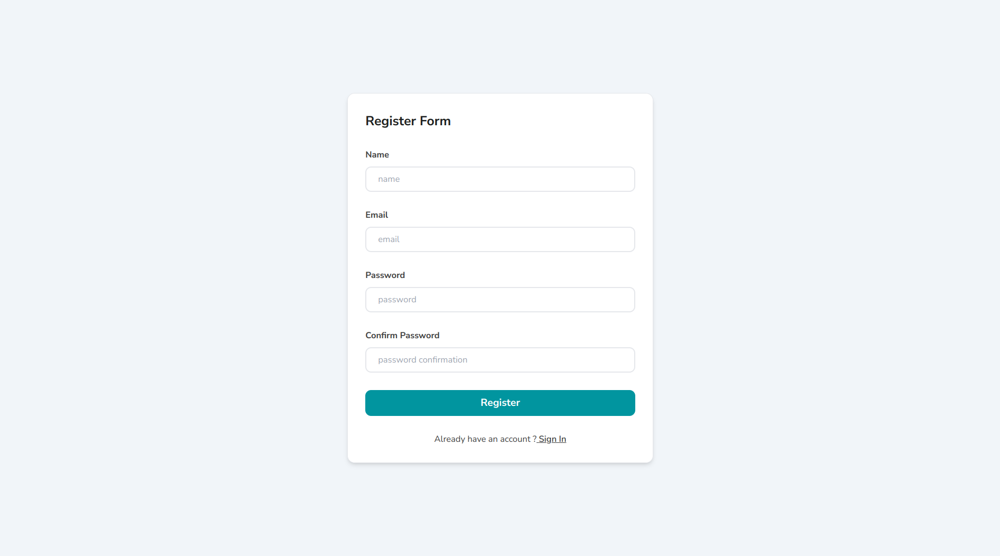
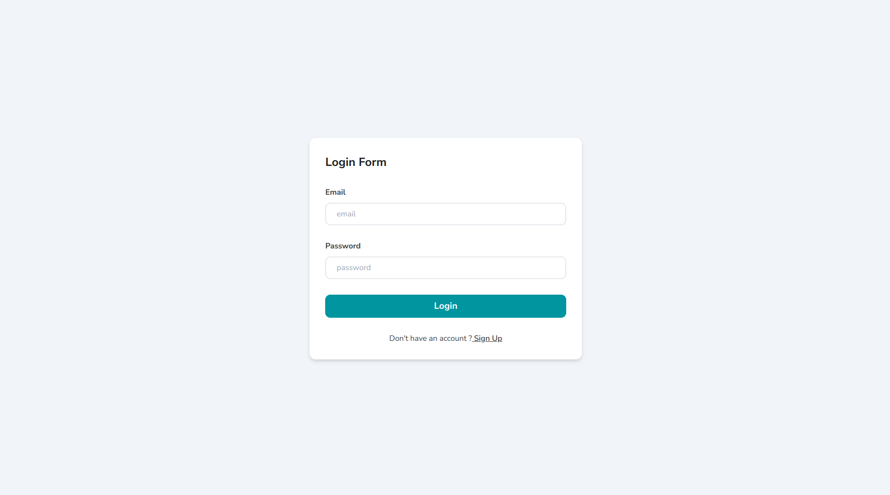
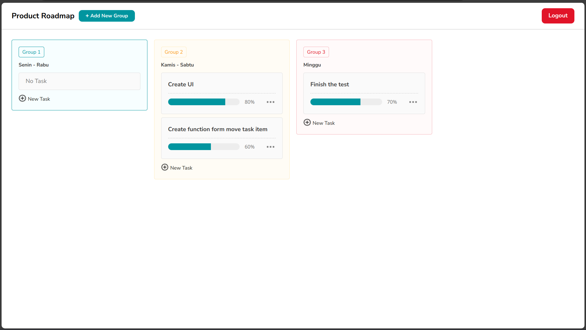
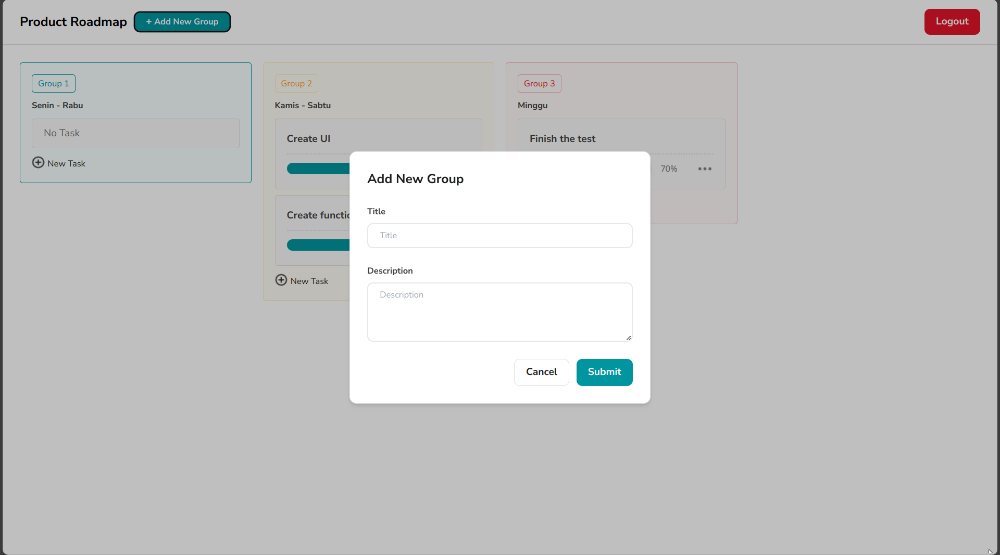
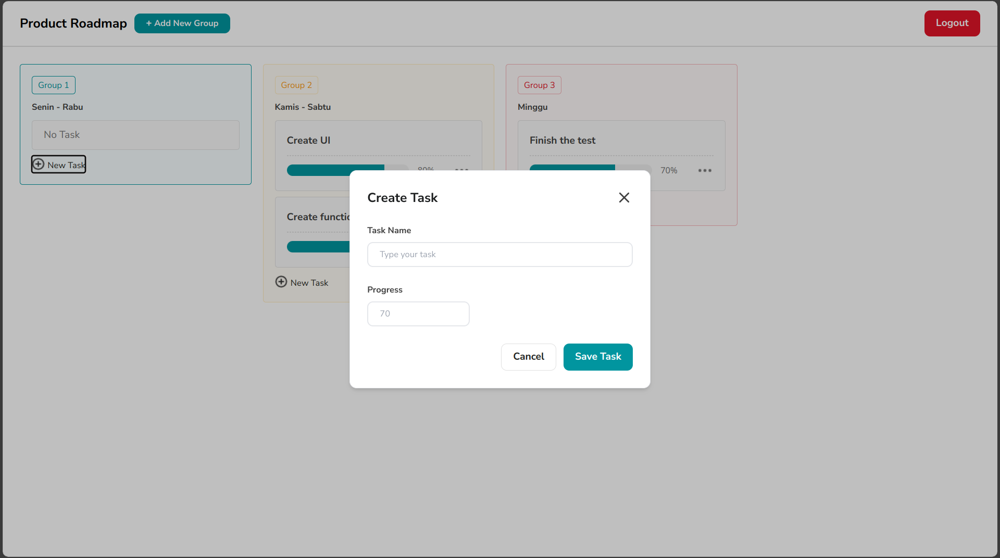
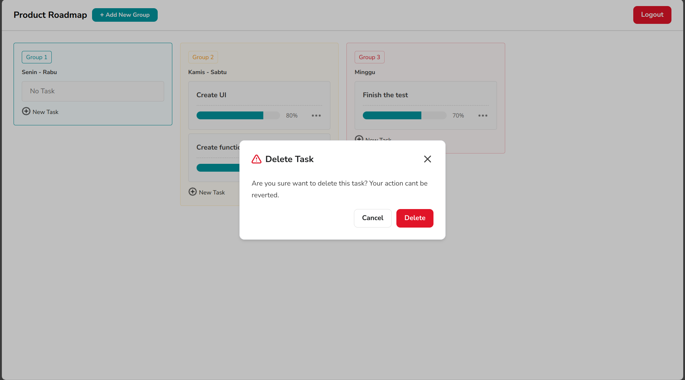
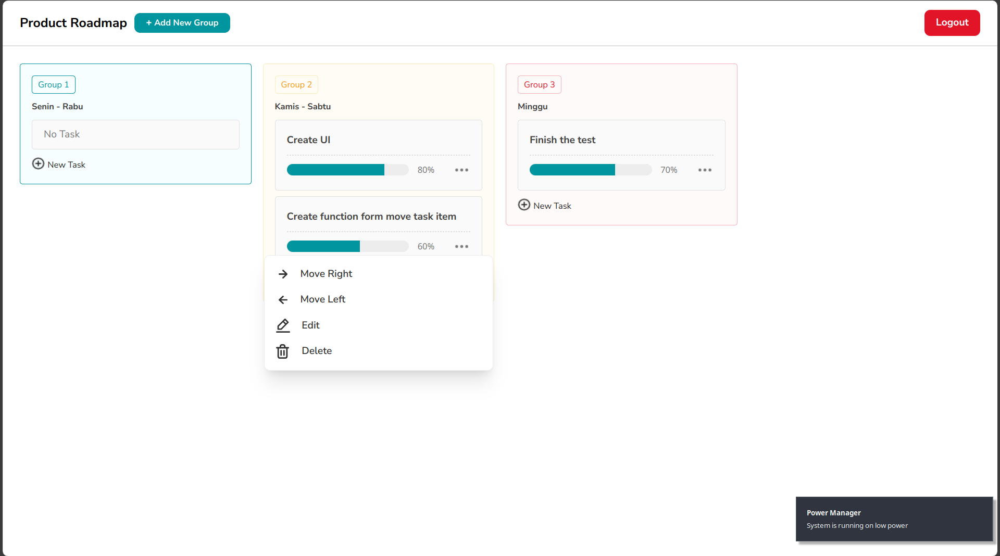

# Simple Kanban Clone

The Kanban Clone project is a web application designed to replicate the core functions and features of a Kanban board, commonly used for task and project management. This application is built using React.js for the user interface, TypeScript to ensure strong, bug-free code, Tailwind CSS for efficient styling, Vite as a fast bundler, SWR for responsive and consistent API data fetching, and Vercel for deployment.

## ✨ Demo

Here is a working live demo : https://simple-canban-clone.vercel.app/
Backend repository : https://github.com/rizalyoga/simple-kanban-be

<!-- ## 🎥 Video Demo

[dashboard-demo.webm](https://github.com/rizalyoga/dashboard-kit/assets/28485636/79cf1f95-81d3-4821-a3d0-8f6831b51bd8) -->

## 🔮 Features

- User authentication (Register and Login).
- Create todo/task groups.
- Create new tasks.
- Edit tasks.
- Delete tasks.
- Move tasks to different todo/task groups.

## 🖼️ Pages

|               Register Page               |
| :---------------------------------------: |
|       |
|             <b>Login Page</b>             |
|          |
|           <b>Dashboard Page</b>           |
|           |
|    <b>Modal Create New Group Task</b>     |
|  |
|       <b>Modal Create New Task</b>        |
|   |
|          <b>Modal Edit Task</b>           |
|     |
|         <b>Modal Delete Task</b>          |
|        |
|             <b>Menu Task</b>              |
|           |

## 🧰 Run in locale

To clone and run this website, you'll need [Git](https://git-scm.com) and [Node.js](https://nodejs.org/en/download/) (which comes with [yarn](https://yarnpkg.com/)) installed on your computer. From your command line:

```bash
# Clone this repository
$ git clone https://github.com/rizalyoga/simple-canban-clone.git

# Go into the repository
$ cd simple-canban-clone

# Create file .env and create variable VITE_BASE_LINK_URL
$ VITE_BASE_LINK_URL= your API link

# Install dependencies
$ yarn

# Run the app
$ yarn dev
```

## ⛏️ Built with

- [React JS](https://react.dev/) - React is a JavaScript library used to build component-based interactive user interfaces. React is created by Facebook and is open-source, so anyone can use it for free.
- [Node JS v20.4.0](https://nodejs.org/id) - Node.js is an open-source, cross-platform JavaScript runtime environment.
- [Yarn](https://yarnpkg.com/) - Yarn is a package manager that doubles down as project manager.
- [Typescript](https://www.typescriptlang.org/) - TypeScript extends JavaScript by adding types to the language.
- [TailwindCSS](https://tailwindcss.com/) - Tailwind CSS is a utility-first CSS framework for rapidly building modern websites without ever leaving your HTML.
- [React-Router_v6](https://reactrouter.com/en/main) - React Router is a standard library for routing in React.
- [SWR](https://swr.vercel.app/) - SWR is a React Hooks library for data fetching.

## 👤 Authors

- [Rizalyoga](https://github.com/rizalyoga/)
